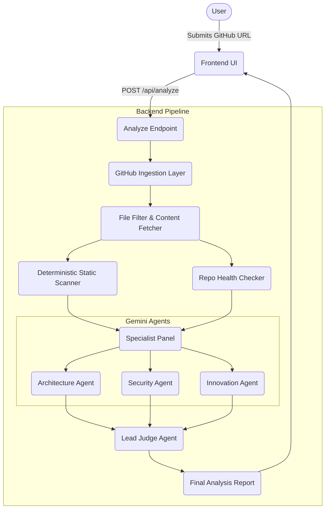
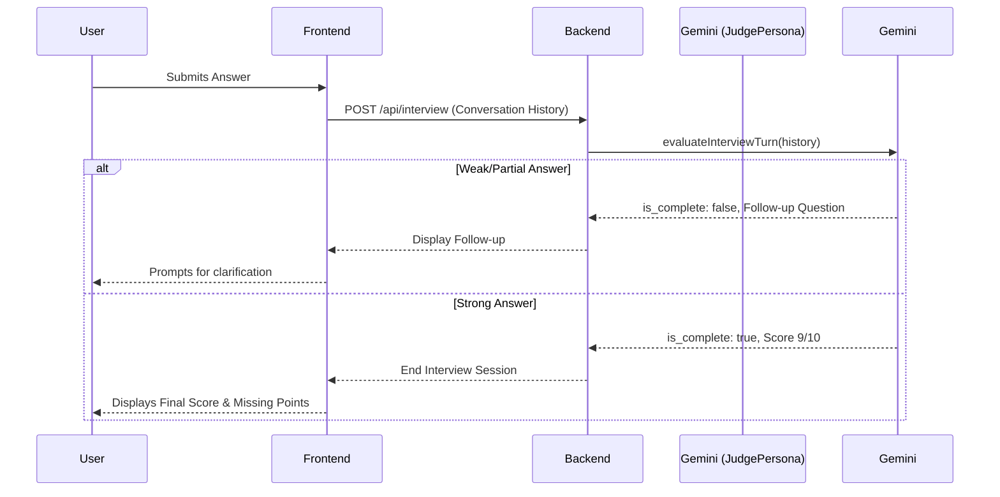

# The Grill - System Architecture

This document outlines the high-level architecture and data flow for **The Grill**, a Next.js-based Monorepo application designed to automatically ingest, analyze, and conduct AI interviews over codebases.

## 1. High-Level Architecture

The system is split into two primary Next.js applications:

- **Frontend (`/frontend`)**: Handles the user interface, renders the interactive chat, displays health metrics, and manages the state of the interview and fix verification flows.
- **Backend (`/backend`)**: Handles GitHub ingestion, deterministic static analysis, and orchestration of the Gemini-powered Multi-Agent system.

## 2. Component Details

### GitHub Ingestion Layer (`backend/lib/github.ts`)
- Parses the repository URL.
- Fetches the recursive repository tree.
- Filters out non-source files (e.g., `node_modules`, images, `.lock` files).
- Fetches raw content only for selected candidate files.

### Deterministic Analysis (`backend/lib/scanner.ts` & `backend/lib/health.ts`)
- **Health Checker**: Deterministically calculates a 0-10 score based on best practices (presence of README, tests, CI/CD, lockfiles).
- **Static Scanner**: A fast heuristic Regex-based scanner that flags hardcoded secrets, `eval()`, open CORS policies, and SQL injection risks. These findings are passed as context to the AI agents.

### Multi-Agent Orchestration (`backend/lib/agents/`)
The AI evaluation is entirely powered by `gemini-3.1-flash-lite`. 
To ensure speed, three specialist agents run concurrently using `Promise.all`:
1. **Architecture Agent**: Evaluates module boundaries, coupling, and scalability.
2. **Security Agent**: Evaluates vulnerabilities, taking the static scanner findings as context.
3. **Innovation Agent**: Evaluates product relevance and technical differentiation.

Once all three agents return their scores, questions, and improvements, the **Lead Judge** synthesizes them into a final verdict without re-reading the raw code.

## 3. The Interactive Interview Flow

When a user attempts to answer a "hard question" about their code, the system initiates a dynamic, stateful conversation.

## 4. Fix & Verify Flow

When a user submits new code to address a flagged vulnerability:
1. The Frontend sends the original code context, the suggested improvement, and the user's updated code.
2. The Backend (`/api/verify-fix`) triggers the Gemini Verification engine.
3. Gemini strictly compares the original flaw with the new code to verify if the specific vulnerability has been remediated, returning a Boolean `resolved` flag and a confidence score.
